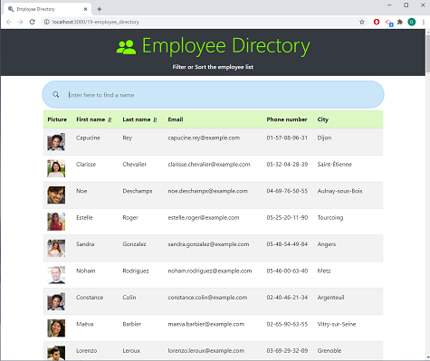
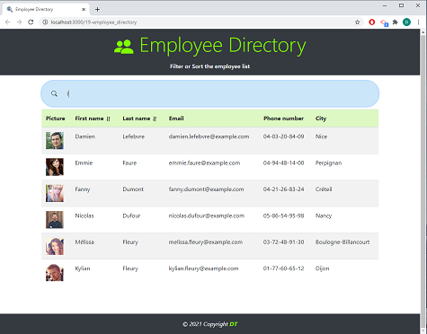

# 19-Employee_Directory
<span align="center">   

---

 <a href="https://img.shields.io/badge/react-v17.0.1-orange?style=plastic"></a>
<a href="https://img.shields.io/badge/axios-v0.21.1-blue?style=plastic"></a>
 <a href="https://img.shields.io/badge/License-MIT-brightgreen?style=plastic"></a>  
 
 </span>

---

## Table of Contents  
* [Description](#Description)
* [User Story and Details](#User-Story-and-Details)  
* [Installation and Usage](#Installation-and-Usage)  
* [Images of the app](#Images-of-the-app-)  
* [License](#License)  
* [Contact](#Contact) 


## Description  
This application allows you to see quickly the employee directory and filter by name. It uses [Random User API](https://randomuser.me/) to get some random users data such as profile pictures and names. The application uses [React](https://reactjs.org/), [axios](https://www.npmjs.com/package/axios) and [Boothstrap](https://getbootstrap.com/docs/4.6/getting-started/introduction/).  


## User Story and Details  

```
User Story Acceptance Criteria
```
```
As a user,  
I want to be able to view my entire employee directory at once so that I have quick access to their information.  
WHEN an employee or manager view the directory,  
they should only view non-sensitive data about other employees. 
WHEN a user see the directory,  
he can sort employees names by alphabetic order.  
WHEN a user search the directory,  
he can filter employees by name so it is easier to find a specific employee record.  

```

:information_source:  
:construction: 
npm dependencies:  
- axios  
- bootstrap  
- gh-pages
- react  
- react-dom   

## Installation and Usage  
You can use directly the [deployed app](https://homework-18-budget-tracker-pwa.herokuapp.com/) on Heroku or run it locally with the following steps: 
- Open a terminal instance  
- Clone the following [repo](https://github.com/Delph-Sunny/19-employee_directory)  
- In the working directory, install the dependencies package with the following code line `npm i`  
- Once the dependencies have been installed, enter `npm start`   

## Images of the App :mag:    
  

Filtering names with the letter "f":  
     

## License  

Copyright (c) 2021 DT. This project is [MIT](https://choosealicense.com/licenses/mit) licensed.

## Contact  

:octocat:  GitHub: [Delphine](https://github.com/Delph-Sunny)  

---